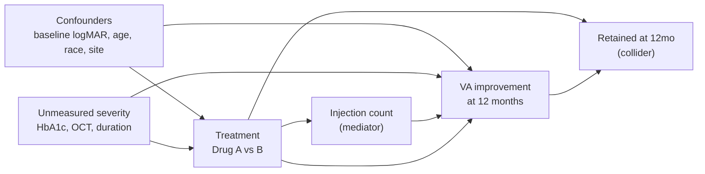

# Statistical analysis plan

Implemented in [`r/analysis.R`](../r/analysis.R) (reference) and
[`src/analyze/run.py`](../src/analyze/run.py) (executable in CI). Both produce
the same estimands.

## Estimands

**Primary.** The **total effect** of Drug A versus Drug B on the probability of
a clinically meaningful VA improvement (>= 0.10 logMAR) at 12 months, among
patients eligible under the cohort definition (ATE). Total effect means
inclusive of whatever the treatment achieves by changing injection frequency;
post-treatment variables are not adjusted.

**Secondary.** (1) Continuous change in logMAR at 12 months. (2) Time to first
clinically meaningful improvement within the follow-up window.

## Causal structure and the adjustment set

The adjustment set is not a list of "available covariates". It is read off an
assumed causal structure. Those assumptions are stated here so a reader can
disagree with them specifically rather than in general.

### Confounders, adjusted

| Variable | Arrow to treatment | Arrow to outcome |
|---|---|---|
| `baseline_logmar` | Worse acuity favours the more aggressive agent | Worse eyes have more room to improve (ceiling effect) |
| `age_at_index` | Influences agent choice and dosing willingness | Independently prognostic for visual recovery |
| `race` | Proxy for insurance, formulary access, referral patterns | Proxy for access to consistent care |
| `site_volume_tertile` | Practice-level formulary preference | Care quality and measurement practice |

`sex` is retained by convention; the DAG posits no strong arrow to treatment,
so it is close to a precision covariate rather than a confounder here.

Baseline severity is the dominant one. Its unweighted standardized mean
difference is ~0.62, far above the 0.1 adequacy threshold, and it alone
accounts for most of the gap between the crude and adjusted estimates.

### Conditional versus marginal: the odds ratio is non-collapsible

The adjusted regression coefficient (OR ~ 2.17) and the IPTW estimate
(OR ~ 1.75) look like disagreement. They are not, they are different
estimands.

A regression coefficient is a **conditional** odds ratio: the effect within
strata of the covariates. IPTW targets a **marginal** odds ratio: the effect in
the population as a whole. Unlike the risk difference and risk ratio, the odds
ratio is **non-collapsible**, conditioning on a strongly prognostic covariate
inflates the conditional OR relative to the marginal one *even when there is no
confounding at all*. With baseline logMAR carrying an SMD of ~0.62, that gap is
substantial.

Standardising the same fitted model over the observed covariate distribution
(g-computation) confirms this:

| Quantity | Value | Type |
|---|---|---|
| Adjusted regression coefficient | 2.17 | Conditional OR |
| Same model, standardised | 1.67 | Marginal OR |
| IPTW | 1.75 | Marginal OR |
| Risk difference | +6.5 pp | Marginal, collapsible |
| Risk ratio | 1.08 | Marginal, collapsible |

The standardised estimate from the outcome model and the IPTW estimate agree to
within sampling noise. Reporting 2.17 and 1.75 side by side without this
distinction would invite a reader to conclude the analysis is unstable.

**For communication, prefer the risk difference.** An absolute increase of about
6.5 percentage points in the probability of meaningful improvement is
interpretable and collapsible; an odds ratio of either 2.17 or 1.75 is neither.

Point estimates only. Valid intervals for the standardised quantities require
a bootstrap that resamples the whole fitting procedure, which is not
implemented.

### Mediator, deliberately NOT adjusted in the primary analysis

`injection_count_yr1` is measured after index and lies on the path
`treatment -> injection count -> outcome`. Both arrows are strongly present in
this cohort: treatment predicts injections (β = 0.86 per arm, p ≈ 1e-100) and
injections predict improvement (β = 0.15 per injection, p ≈ 5e-16).

Conditioning on it blocks the indirect path and attenuates the estimate:

| Model | OR | Estimand |
|---|---|---|
| Confounders only | 2.17 (1.88–2.51) | **Total effect (primary)** |
| Confounders + mediator | 1.94 (1.68–2.25) | Controlled direct effect |

Roughly 10% of the apparent benefit operates through more frequent injection.
That is a real part of what the treatment does, and the primary estimand
includes it. An earlier version of this plan adjusted for the mediator in the
outcome model while excluding it from the propensity model, an internal
inconsistency that quietly reported a direct effect as though it were the
treatment effect. Both are now reported and labelled.

### Collider, a known limitation, not fixed by adjustment

Cohort entry requires a 12-month acuity measurement. Retention is not random:
it falls from 95.1% in the best baseline-severity quartile to 88.8% in the
worst, and differs slightly by arm (92.2% vs 93.2%). Since treatment and
outcome both influence retention, conditioning on it opens a collider path.

No adjustment for measured confounders fixes this. It is a limitation of the
completers-only design, and the honest mitigations are a sensitivity analysis
under different missingness assumptions, or an estimand defined on all
initiators with multiple imputation.

### Unmeasured confounding

Diabetes duration, HbA1c, OCT central subfield thickness, prior treatment
history, and insurance status are all plausibly on backdoor paths and none are
available. `baseline_logmar` is a partial proxy at best. No estimator recovers
a variable that is not in the data; an E-value would quantify how strong the
residual confounding would need to be to explain the result away.

## Analysis sequence

1. **Table 1**, baseline characteristics by arm, with standardized mean
   differences rather than p-values. A p-value comparing baseline
   characteristics in an observational cohort tests a hypothesis nobody holds;
   the SMD reports the magnitude of imbalance, which is what actually matters
   for confounding.

2. **Crude estimate**, unadjusted logistic regression. **Reported alongside
   the adjusted estimate, always.** In this cohort the crude and adjusted
   estimates differ by roughly a factor of two; presenting only the adjusted
   one conceals how much of the result is coming from the model rather than
   from the data.

3. **Multivariable logistic regression**, adjusted for the confounder set
   only (age, sex, race, baseline logMAR, site volume tertile). The
   coefficient is a conditional OR; g-computation over the same model gives
   the marginal contrast, plus the risk difference and risk ratio.

4. **IPTW**, stabilized weights from a propensity model, with weights trimmed
   at the 99th percentile. Balance assessed by SMD before and after weighting,
   with 0.1 as the conventional adequacy threshold. Robust or bootstrap
   standard errors are required for valid inference; the naive CI is not
   correct and is labelled as such in the output.

   The propensity model uses the same confounder set as the outcome model. No
   post-treatment variable appears in either.

4b. **Controlled direct effect (secondary)**, the primary model plus
   `injection_count_yr1`. Reported separately and explicitly labelled, because
   an adjusted estimate that silently conditions on a mediator is easy to
   mistake for the treatment effect.

5. **Time to event**, Kaplan-Meier by arm and adjusted Cox proportional
   hazards. The PH assumption is tested (`cox.zph`) and the result reported
   whether or not it holds; a violated PH assumption means the hazard ratio is
   a weighted average over follow-up rather than a constant effect.

## What would strengthen this

- Negative control outcome to detect residual confounding
- E-value for the minimum unmeasured confounding that would explain the result
- Sensitivity analysis under different missingness assumptions for the
  patients excluded for lacking a 12-month measurement
- Eye-level analysis with a patient-level random effect

## Interpretation

The data are synthetic and generated with a known confounding structure.
Results characterize the generating process and the estimators' behaviour
under it. **No clinical conclusion about any real therapy follows from them.**
